# EE2026 FPGA Graphing Calculator

A fully functional graphing calculator implemented entirely in Verilog HDL on the Basys3 FPGA board, featuring real-time polynomial plotting, interactive mouse-controlled UI, and comprehensive arithmetic operations.

## 📋 Project Overview

This project demonstrates advanced digital design principles by implementing a complete graphing calculator system on an FPGA. Using only hardware description language (Verilog), the calculator performs arithmetic operations, plots mathematical functions, and provides an interactive user interface—all running directly on programmable logic.

**Course:** EE2026 - Digital Design  
**Platform:** Digilent Basys3 (Xilinx Artix-7 FPGA)  
**Language:** Verilog HDL  
**Input:** PS/2 Wireless Mouse  
**Display:** OLED Module (via JC port)

---

## ✨ Key Features

### 🧮 Arithmetic Operations
- **Basic Operations:** Addition (+), Subtraction (−), Multiplication (×), Division (÷)
- **Number Formats:** Integer and fixed-point arithmetic
- **Radix Conversion:** Support for multiple number bases
- **Real-time Calculation:** Hardware-accelerated computation

### 📊 Graphing Capabilities
- **Function Plotting:** Polynomial and mathematical functions
- **Real-time Rendering:** Graph updates displayed on OLED screen
- **Coordinate System:** Scaled fixed-point arithmetic for accurate plotting
- **Interactive Visualization:** Dynamic graph generation

### 🖱️ User Interface
- **Mouse Control:** PS/2 wireless mouse for navigation
- **Interactive Keypad:** Virtual button interface
- **Visual Feedback:** OLED display with real-time updates
- **Debugging Outputs:** LED indicators and seven-segment display

---

## 🏗️ System Architecture

```mermaid
flowchart TB
    subgraph Input["🖱️ Input Devices"]
        A[PS/2 Wireless Mouse]
        B[Basys3 Switches]
        C[Basys3 Buttons]
    end
    
    subgraph FPGA["⚙️ Basys3 FPGA - Artix-7"]
        D[Clock Division & Timing]
        E[Top_Student.v<br/>Main Controller]
        F[Mouse Controller<br/>PS/2 Protocol]
        G[UI State Machine]
        H[Arithmetic Units]
        I[Graph Plot Engine]
        J[Display Controller]
    end
    
    subgraph Arithmetic["🧮 Computation Modules"]
        K[addsub_function<br/>Add/Subtract]
        L[muldiv_function<br/>Multiply/Divide]
        M[Fixed-Point Scaler]
        N[Radix Converter]
    end
    
    subgraph Output["📺 Output Devices"]
        O[OLED Display<br/>JC Port]
        P[7-Segment Display]
        Q[LED Indicators]
    end
    
    A --> F
    B --> E
    C --> E
    D --> E
    E --> G
    G --> H
    G --> I
    F --> G
    H --> K
    H --> L
    H --> M
    H --> N
    K --> J
    L --> J
    I --> J
    M --> I
    J --> O
    E --> P
    E --> Q
```



---

## 🔧 Hardware Specifications

### Basys3 FPGA Board
- **FPGA:** Xilinx Artix-7 (XC7A35T-1CPG236C)
- **Logic Cells:** 33,280
- **Block RAM:** 1,800 Kbits
- **Clock:** 100 MHz system clock

### Peripherals
| Component | Connection | Function |
|-----------|------------|----------|
| **OLED Display** | JC Pmod Port | Primary graphical output (96×64 pixels typical) |
| **PS/2 Mouse** | PS/2 Port | Interactive UI navigation and selection |
| **7-Segment Display** | Basys3 Built-in | Numeric result display |
| **LEDs** | Basys3 Built-in | Status indicators and debugging |
| **Switches** | Basys3 Built-in | Mode selection and configuration |
| **Buttons** | Basys3 Built-in | Additional input controls |

---

## 💻 Module Architecture

### Hierarchical Design Structure

```
Top_Student.v (Top-Level Integration)
├── Clock Divider Module
│   └── Generates timing signals from 100MHz system clock
│
├── Mouse Controller
│   ├── PS/2 protocol decoder
│   ├── Position tracking
│   └── Click detection
│
├── UI State Machine
│   ├── Keypad/button selection logic
│   ├── Mode switching (calculate/graph/settings)
│   └── User input processing
│
├── Arithmetic Unit
│   ├── addsub_function.v
│   │   ├── Binary adder/subtractor
│   │   └── Overflow detection
│   ├── muldiv_function.v
│   │   ├── Sequential multiplier
│   │   └── Restoring division algorithm
│   └── Radix conversion logic
│
├── Graph Plot Engine (Graph_Plot.v)
│   ├── Function evaluator
│   ├── Coordinate transformation
│   ├── Fixed-point arithmetic scaler
│   └── Pixel plotting logic
│
└── Display Controller
    ├── OLED SPI interface
    ├── Frame buffer management
    └── Pixel write controller
```

---

## 🎮 User Interface Design

### Operational Modes


### Virtual Keypad Layout
```
┌─────────────────────────────────┐
│  7   8   9   ÷   (   )   DEL    │
│  4   5   6   ×   x   ^   CLR    │
│  1   2   3   −   .   ±          │
│  0   =   +   Plot  Back          │
└─────────────────────────────────┘
```

**Mouse Interaction:**
- **Hover:** Button highlight feedback
- **Click:** Register input/operation
- **Position Tracking:** Real-time cursor display

---

## 📊 Graph Plotting System

### Fixed-Point Arithmetic

To enable accurate graphing on integer-only hardware, the system uses fixed-point representation:

```
Fixed-Point Format: Qm.n
├── m: Integer bits
├── n: Fractional bits
└── Example: Q8.8 (8 integer, 8 fractional) = 16-bit total

Scaling Formula:
    Fixed_Value = Float_Value × 2^n
    
Example: 3.75 in Q8.8
    = 3.75 × 256 = 960 (decimal)
    = 0x03C0 (hexadecimal)
```

### Coordinate Transformation

```verilog
// Pseudocode for pixel plotting
for (x_pixel = 0; x_pixel < SCREEN_WIDTH; x_pixel++) {
    // Scale pixel to mathematical coordinate
    x_math = (x_pixel - ORIGIN_X) * SCALE_FACTOR;
    
    // Evaluate polynomial: y = ax² + bx + c
    y_math = (a * x_math * x_math) + (b * x_math) + c;
    
    // Transform back to pixel coordinate
    y_pixel = ORIGIN_Y - (y_math / SCALE_FACTOR);
    
    // Plot if within screen bounds
    if (y_pixel >= 0 && y_pixel < SCREEN_HEIGHT) {
        plot_pixel(x_pixel, y_pixel);
    }
}
```

### Plotting Algorithm Flow


---

## ⚙️ Technical Implementation

### Clock Management

**System Clock:** 100 MHz from Basys3 oscillator

**Clock Division Strategy:**
```verilog
// Generate slower clocks for peripherals
// OLED refresh: ~60 Hz
// Mouse polling: ~100 Hz
// Display update: Variable based on operation

reg [31:0] counter;
wire clk_oled = counter[20];     // ~95 Hz
wire clk_mouse = counter[19];    // ~190 Hz
wire clk_refresh = counter[18];  // ~381 Hz

always @(posedge clk) begin
    counter <= counter + 1;
end
```

### Arithmetic Unit Design

#### Addition/Subtraction (`addsub_function.v`)
- **Method:** Ripple-carry adder with two's complement
- **Width:** Configurable bit width (default 16-bit)
- **Overflow:** Detection flag output
- **Latency:** Single clock cycle

#### Multiplication (`muldiv_function.v`)
- **Method:** Sequential shift-and-add (Booth's algorithm optional)
- **Width:** 16-bit × 16-bit = 32-bit result
- **Latency:** 16 clock cycles
- **Optimization:** Early termination for small multiplicands

#### Division (`muldiv_function.v`)
- **Method:** Restoring division algorithm
- **Width:** 32-bit ÷ 16-bit = 16-bit quotient + remainder
- **Latency:** 16 clock cycles
- **Error Handling:** Division-by-zero detection

### State Machine Design

```verilog
// Example: Calculator Mode FSM
typedef enum {
    IDLE,
    INPUT_NUM1,
    SELECT_OP,
    INPUT_NUM2,
    COMPUTE,
    DISPLAY_RESULT
} calc_state_t;

reg [2:0] current_state, next_state;

always @(posedge clk or posedge rst) begin
    if (rst)
        current_state <= IDLE;
    else
        current_state <= next_state;
end

always @(*) begin
    case (current_state)
        IDLE: 
            next_state = mouse_click ? INPUT_NUM1 : IDLE;
        INPUT_NUM1:
            next_state = enter_pressed ? SELECT_OP : INPUT_NUM1;
        // ... additional states
    endcase
end
```

---

## 🚀 Key Features Demonstration

### 1. Arithmetic Calculation
```
Example: Calculate 123 + 456
1. Select "Calculator" mode
2. Mouse click numbers: 1 → 2 → 3
3. Click operation: +
4. Mouse click numbers: 4 → 5 → 6
5. Click "="
6. Result displayed: 579 (on 7-seg + OLED)
```

### 2. Polynomial Graphing
```
Example: Plot y = x² - 4x + 3
1. Select "Graph" mode
2. Enter coefficients:
   - a = 1 (x² term)
   - b = -4 (x term)  
   - c = 3 (constant)
3. Set range: X[-5, 5], Y[-2, 8]
4. Click "Plot"
5. Parabola renders on OLED with vertex at (2, -1)
```

### 3. Radix Conversion
```
Example: Convert decimal 255 to other bases
- Binary: 11111111
- Octal: 377
- Hexadecimal: FF
Display cycles through each representation
```

---

## 🛠️ Design Principles Demonstrated

### 1. Hierarchical Modularity
- **Top-down design:** System decomposed into functional blocks
- **Reusable modules:** Arithmetic units can be instantiated multiple times
- **Clean interfaces:** Well-defined input/output ports

### 2. Finite State Machines
- **UI control flow:** Modes and transitions
- **Sequential operations:** Multi-cycle arithmetic
- **Error handling:** Invalid input detection

### 3. Fixed-Point Arithmetic
- **Integer-only hardware:** No floating-point units needed
- **Precision control:** Balance between range and accuracy
- **Efficient scaling:** Bit-shift operations for multiplication/division by powers of 2

### 4. Timing and Synchronization
- **Clock domain management:** Different peripherals on appropriate clock rates
- **Debouncing:** Mouse/button input stabilization
- **Pipeline considerations:** Multi-cycle operation coordination

### 5. Hardware Debugging
- **LED indicators:** Real-time status monitoring
- **Seven-segment display:** Immediate numeric feedback
- **Modular testing:** Each component verified independently

---

## 📁 Repository Structure

```
EE2026-Graphing-Calculator/
├── README.md
├── src/
│   ├── Top_Student.v              # Top-level integration module
│   ├── arithmetic/
│   │   ├── addsub_function.v      # Addition/Subtraction unit
│   │   ├── muldiv_function.v      # Multiplication/Division unit
│   │   └── radix_converter.v      # Number base conversion
│   ├── graphics/
│   │   ├── Graph_Plot.v           # Polynomial plotting engine
│   │   ├── oled_controller.v      # OLED SPI interface
│   │   └── pixel_buffer.v         # Frame buffer management
│   ├── input/
│   │   ├── mouse_controller.v     # PS/2 mouse handler
│   │   └── button_debounce.v      # Input stabilization
│   └── utils/
│       ├── clock_divider.v        # Clock generation
│       └── seven_seg_driver.v     # 7-segment display driver
├── constraints/
│   └── Basys3_Master.xdc          # Pin assignments and timing constraints
├── testbenches/
│   ├── tb_arithmetic.v            # Arithmetic unit testbench
│   ├── tb_graph_plot.v            # Graph plotting testbench
│   └── tb_top.v                   # System-level testbench
└── docs/
    ├── design_specification.pdf
    ├── user_manual.pdf
    └── module_diagrams/
```

---

## 🧪 Testing and Verification

### Simulation Testbenches
```verilog
// Example: Arithmetic unit testbench
module tb_arithmetic;
    reg [15:0] a, b;
    reg [1:0] op;  // 00:add, 01:sub, 10:mul, 11:div
    wire [31:0] result;
    wire overflow;
    
    arithmetic_unit UUT (
        .a(a), .b(b), .op(op),
        .result(result), .overflow(overflow)
    );
    
    initial begin
        // Test addition
        a = 16'd100; b = 16'd50; op = 2'b00; #10;
        assert(result == 150) else $error("Add failed");
        
        // Test multiplication
        a = 16'd12; b = 16'd13; op = 2'b10; #200;
        assert(result == 156) else $error("Multiply failed");
        
        // ... additional test cases
        $finish;
    end
endmodule
```

### Hardware Validation
1. **LED test patterns:** Verify basic I/O functionality
2. **Seven-segment countdown:** Confirm clock division accuracy
3. **Mouse cursor tracking:** Test PS/2 communication
4. **OLED pixel test:** Validate display controller
5. **Arithmetic verification:** Cross-check with software calculator
6. **Graph accuracy:** Compare with MATLAB/Python plots

---

## 🎓 Learning Outcomes

### Digital Design Concepts
- ✅ **Verilog HDL mastery:** Behavioral and structural modeling
- ✅ **FSM design:** State encoding, transitions, and output logic
- ✅ **Arithmetic circuits:** Adders, multipliers, dividers
- ✅ **Fixed-point arithmetic:** Scaling and precision management
- ✅ **Clock management:** Dividers, synchronization, timing constraints

### FPGA-Specific Skills
- ✅ **Basys3 development:** Constraints file, pin mapping, resource utilization
- ✅ **Peripheral interfacing:** OLED SPI, PS/2 protocol, LED/7-seg drivers
- ✅ **Synthesis considerations:** Optimization, LUT usage, routing
- ✅ **Hardware debugging:** ILA insertion, signal probing, timing analysis

### System Integration
- ✅ **Modular architecture:** Hierarchy, reusability, maintainability
- ✅ **Interface design:** Clean module boundaries, bus protocols
- ✅ **Real-time constraints:** Meeting timing closure, minimizing latency
- ✅ **User experience:** Intuitive controls, visual feedback

---

## 🚧 Challenges and Solutions

### Challenge 1: Fixed-Point Precision
**Problem:** Limited fractional bits caused rounding errors in graph plots  
**Solution:** 
- Implemented Q16.16 format (16 integer, 16 fractional bits)
- Added rounding logic instead of truncation
- Pre-scaled coefficients to minimize intermediate overflow

### Challenge 2: OLED Refresh Rate
**Problem:** Slow pixel-by-pixel updates caused visible flickering  
**Solution:**
- Implemented double-buffering in block RAM
- Generated complete frame before display update
- Optimized SPI clock to maximum supported rate

### Challenge 3: Mouse Latency
**Problem:** PS/2 protocol interrupts disrupted main logic timing  
**Solution:**
- Created dedicated mouse controller with state machine
- Used FIFO buffer to decouple mouse events from main logic
- Implemented interrupt-free polling at consistent intervals

### Challenge 4: Resource Utilization
**Problem:** Initial design exceeded available LUTs and block RAM  
**Solution:**
- Shared arithmetic units across different operations (time-multiplexing)
- Reduced frame buffer depth (single-buffering for calculator mode)
- Optimized state encoding (one-hot vs. binary trade-offs)

---

## 🏆 Project Achievements

- ✅ Fully functional graphing calculator on FPGA hardware
- ✅ Real-time polynomial plotting with fixed-point precision
- ✅ Intuitive mouse-driven user interface
- ✅ Comprehensive arithmetic operations (add, subtract, multiply, divide)
- ✅ Multiple display modes (numeric, graphical, debugging)
- ✅ Modular Verilog design suitable for extension
- ✅ Meets timing constraints on Basys3 (100 MHz clock)
- ✅ Demonstrates advanced digital design principles

---

## 🔮 Future Enhancements

### Potential Upgrades
- [ ] **Trigonometric functions:** sin, cos, tan with CORDIC algorithm
- [ ] **3D surface plotting:** Add Z-axis support for f(x, y)
- [ ] **Equation solver:** Newton-Raphson method for root finding
- [ ] **Matrix operations:** Linear algebra functions
- [ ] **User presets:** Save/load common functions to block RAM
- [ ] **Higher resolution:** Upgrade to larger OLED/VGA output
- [ ] **Keyboard input:** Full expression entry (vs. virtual keypad)
- [ ] **Faster computation:** Pipeline arithmetic units for parallel operations

---

## 📚 References

### Technical Documentation
- Digilent Basys3 Reference Manual
- Xilinx Artix-7 FPGAs Data Sheet (DS181)
- OLED Display Controller Datasheet (SSD1306/SSD1331)
- PS/2 Mouse Protocol Specification

### Course Materials
- EE2026 Digital Design Lecture Notes
- Verilog HDL: A Guide to Digital Design and Synthesis (Samir Palnitkar)
- FPGA Prototyping by Verilog Examples (Pong P. Chu)

---

## 👥 Acknowledgments

- **EE2026 Teaching Team:** For comprehensive digital design curriculum
- **Lab Instructors:** Technical guidance and debugging support
- **Digilent/Xilinx:** Hardware platforms and development tools

---

## 📝 License

This project was completed as part of the EE2026 Digital Design course curriculum at the National University of Singapore.

---

*This project showcases the power of FPGAs for implementing complex digital systems entirely in hardware, demonstrating that sophisticated applications like graphing calculators can run on reconfigurable logic without software or processors.*
